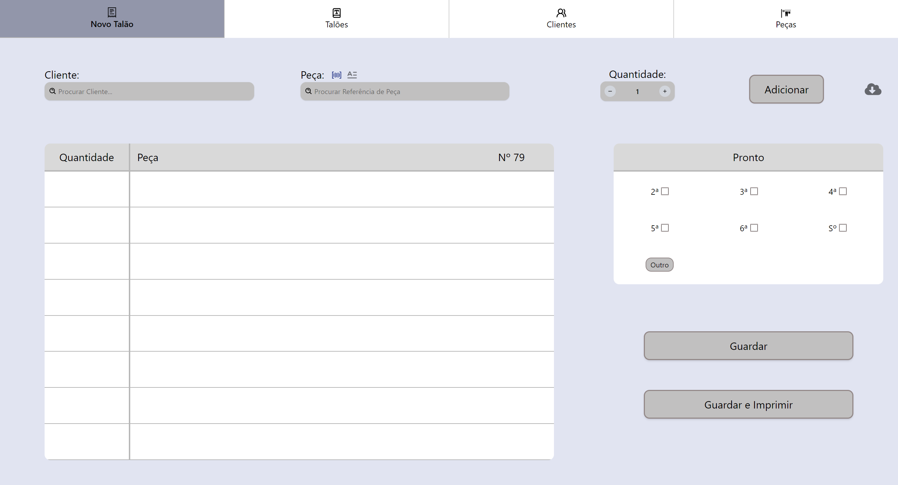

# WashWise - Laundry Management App
WashWise is a desktop application for laundry management, built with Electron, React, and SQLite. It provides a seamless way to manage customers, products, and orders while working completely offline, ensuring reliability and fast operations.

## Tech Stack
- Electron (Desktop App) 
- React (Frontend)
- SQLite (Local Database)

## Features

- Customer management (add, edit, delete)
- Laundry item management
- Create and manage service orders
- ESC/POS receipt printing
- Local data storage with SQLite
- 100% offline functionality 
- One-Click database backup


## Screenshots

### New Order Tab (empty state)

Initial screen to create a new order, search for customers and items, add products and define the ready-for-pickup day.



### New Order Tab (with items added)

Displays customer and item selection, quantity, optional notes per item, and pick-up day selection. The "Save and Print" button generates and prints the receipt automatically.


### Client Management Tab

Displays customer management with search and filter functionality. The table lists registered customers, while the side panel allows creating or editing customer records with name, phone number, and address details.


### Product Management Tab

Displays item management with search and filter functionality. The table lists existing items, while the side panel allows creating or editing entries with reference, type, color, style, and value.


## How to run (for development)

1. Clone the repository:
```bash
git clone https://github.com/RodG23/WashWise.git
```

2. Install dependencies:
```bash
cd washwise-app
npm install
```

3. Run Frontend:
```bash
npm run dev
```

4. Run desktop app:
```bash
npm run electron
```
<br/>

## How to install (for Windows)

Download and execute the installer.

 [](https://github.com/RodG23/WashWise/raw/main/WashWise_Setup.exe)


---

WashWise is designed to simplify and streamline laundry business operations.


